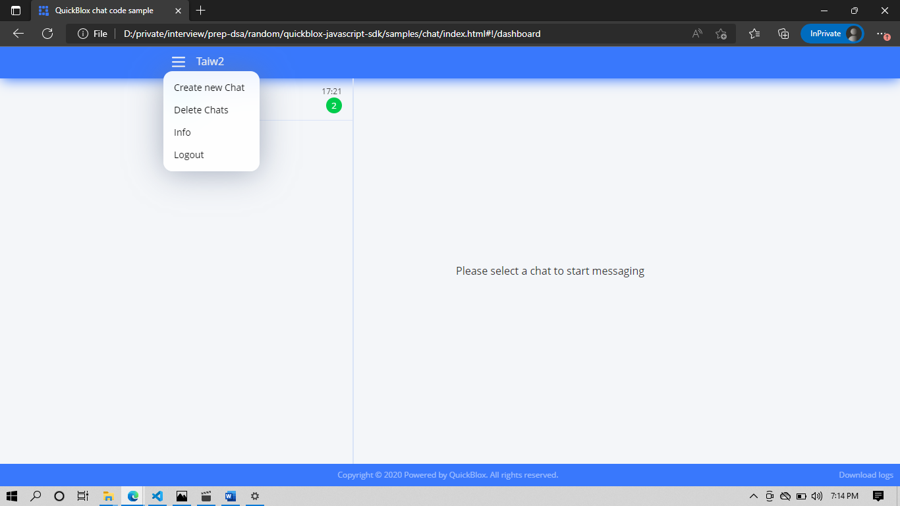
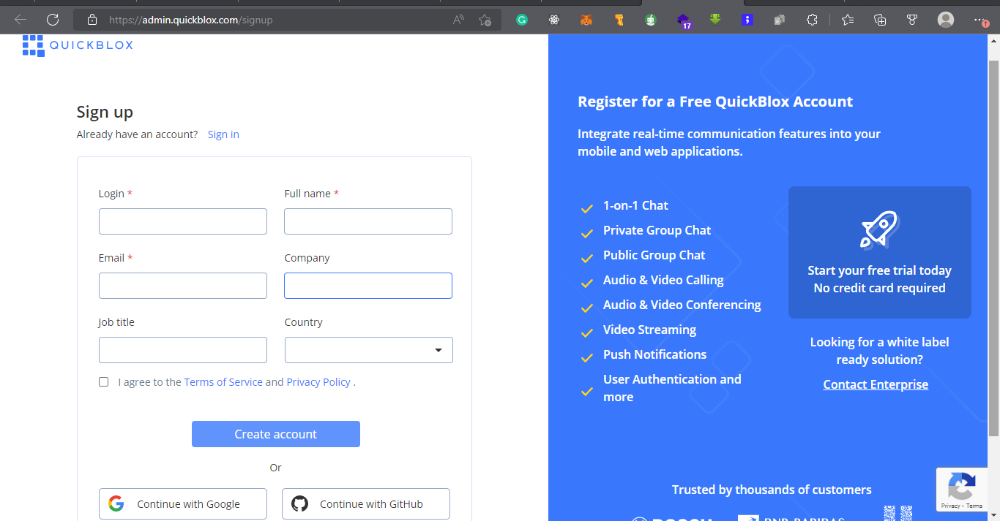
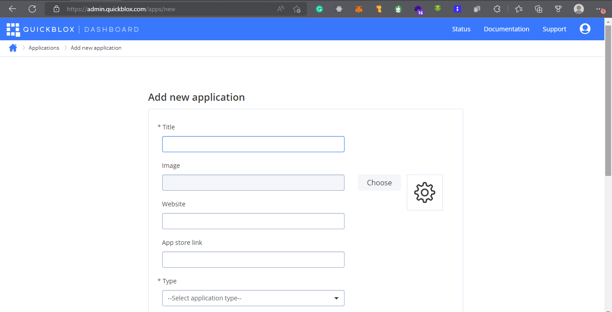
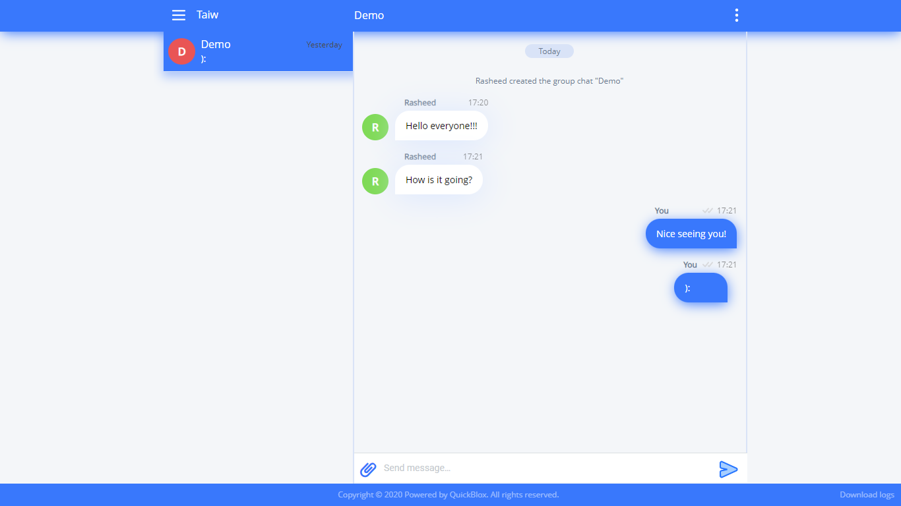

##  Building a full-blown chatting app with QuickBlox API in under 100 seconds

Social interaction within an organization and among customers is very crucial and important in communication. The right and easy communication channel can help improve productivity when the employees are not distracted by unnecessary notifications and other engagement that can come up using public communication channels. 
For this reason, it is necessary for every organization that wishes to tap from this, to increase the productivity of their employees to implement in-house chatting and meeting tools which is the service from the QuickBlox team. In this discussion, I will show you how to build and implement chatting applications on the web using QuickBlox API. 
This requires little or no knowledge of programming and everything will be up and running under 100 seconds using the QuickBlox JavaScript SDK, this is the JavaScript library that provides easy access to the QuickBlox cloud communication services. The Software Development Kit (SDK) contains many features and services provided by the QuickBlox backend but in this guide, we will be focusing on the chat part of the SDK which includes the following

- Sign in and sign out
- Send and receive messages, images and other attachment
- Create and leave  general chat
- Create a general or 1-1 chat
- Show read messages and who have received the message
- Send typing indicators
- Delete messages and chats
- Display chat history
- Display a list of participants in the chats

### What is [QuickBlox](https://quickblox.com/)?

According to the QuickBlox product page, it is a suite of communication features & data services (APIs, SDKs, code samples, admin panel, tutorials) which help digital agencies, mobile developers and publishers to add great communication functionality to smartphone applications like in Skype, WhatsApp, Viber

Step 1:	Create an account and get the necessary credentials on QuickBlox.

Making API request require API keys and credentials. To make this seamless, the team at QuickBlox has made a simple way of getting the development and test account up and running within seconds. 
1.  Create an account on the QuickBlox platform by simply clicking the link here. To make this easier the team included third-party authentication which implies using Google or GitHub to an account up and running.

Step 2:	Create your first QuickBlox app.

1.  Click the create app button on the dashboard. At the moment it will look like something below.
1.  Fill out the form that pops up. Not all fields are required at this point. Fill out the required fields, you can actually come back to update this later. The only required fields are the app title and type.
1.  Click on create and scroll to view the generated credentials. Leave this tab open or copy and save the credentials in a safe environment.

Step3:	Implementing chat with the credentials

Now that you have the required credentials, it is now time to use them. Follow the steps to create a build a complete chatting app. Right now, you are thinking about who will build the UI. Who will manage the database and other requirements of a chatting app? Don’t worry, QuickBlox get you covered on all this.

1.  Get all code required from the [QuickBlox GitHub repository using this link](https://github.com/QuickBlox/quickblox-javascript-sdk).
1.  Clone the repository and open the folder QuickBlox-javascript-sdk, then copy out the chat folder.
1.  Inside the chat folder, Locate the JS folder and then the QBconfig.js file.
1.  Update the credentials object with your app credential gotten from step 2

Step 4:	Running and testing the app built

Inside the same chat folder at the root, locate the index.html file and open it with your favourite browser. Login with any credentials of your own. Since this is a test account. Do any of the following to have it done for who in a simple way.
Apart from the browser opened before via the HTML file, copy the same URL path from the browser address bar.
1.  Open another tab in incognito mode and sign in with another user's details.
2.  Click the hamburger button on the left top side of the web page
3.  Click create a chat room and add the number of roommates you wish to have 1 for 1-1 or many 1-many chat rooms.
4.  You can log out and delete chat when necessary

Step 5:	Track your app actions

Track users, push notifications and contents shared in the dashboard of every app created. Below are the tabs included in the app dashboard.
- Users: This is where the details of every user using the app
- Chats: This contains chat information of the app users
- Contents: This contains the 
- Push notifications: This sends the notification messages to all users of your app which includes locked screen notifications for android or iOS apps
- Overview: This is the credentials page
- Customs: This is where you can manually add users and edit users’ permissions

Conclusively, the [QuickBlox solution](https://docs.quickblox.com/) is as simple as explained to implement all services from the QuickBlox as above. Try it out and thank me later.
